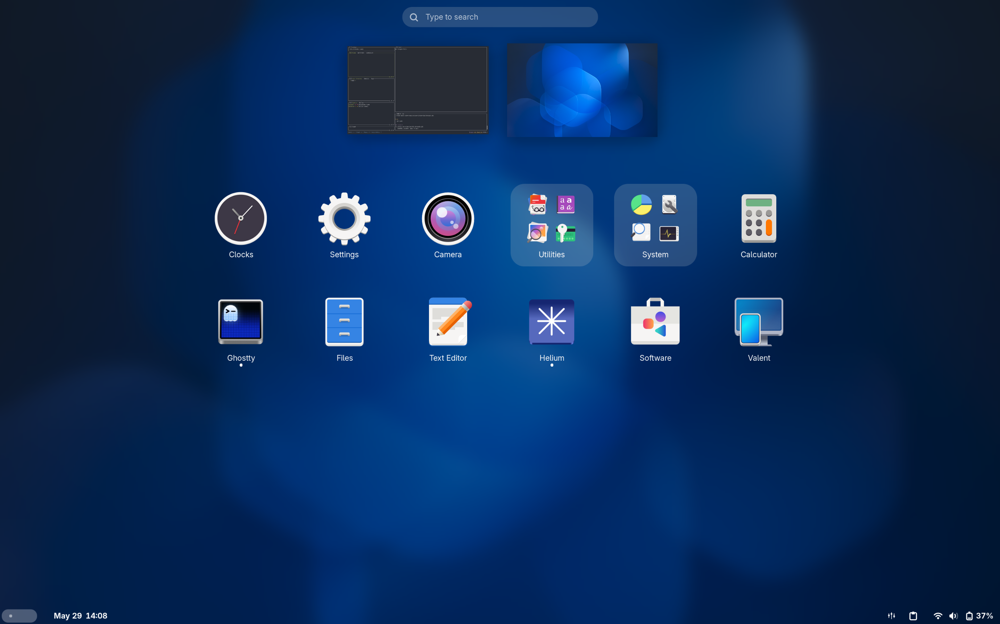

# nix.einstein
My Gnome NixOS Configuraiton



## Declerative

## Imperative

- Flatpak
```sh
flatpak remote-add --if-not-exists flathub https://dl.flathub.org/repo/flathub.flatpakrepo
```
- Easyeffects
```
flatpak install flathub com.github.wwmm.easyeffects
```
