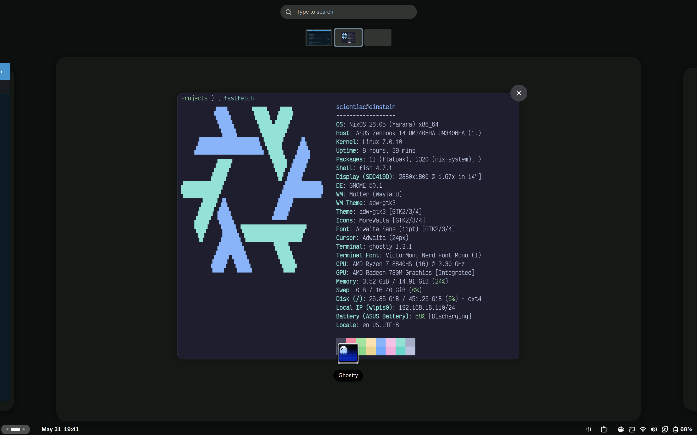
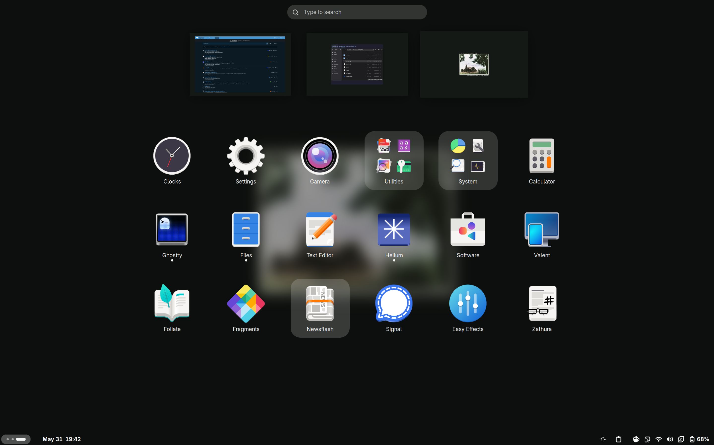

# nix.einstein
My Gnome NixOS Configuraiton

| Desktop | Drawer |
| :----: | :----: |
|  |  |

## Declerative
```sh
sudo nixos-rebuild switch --flake .#einstein
```

## Imperative
For testing applications.

- Flatpak
```sh
flatpak remote-add --if-not-exists flathub https://dl.flathub.org/repo/flathub.flatpakrepo
```
